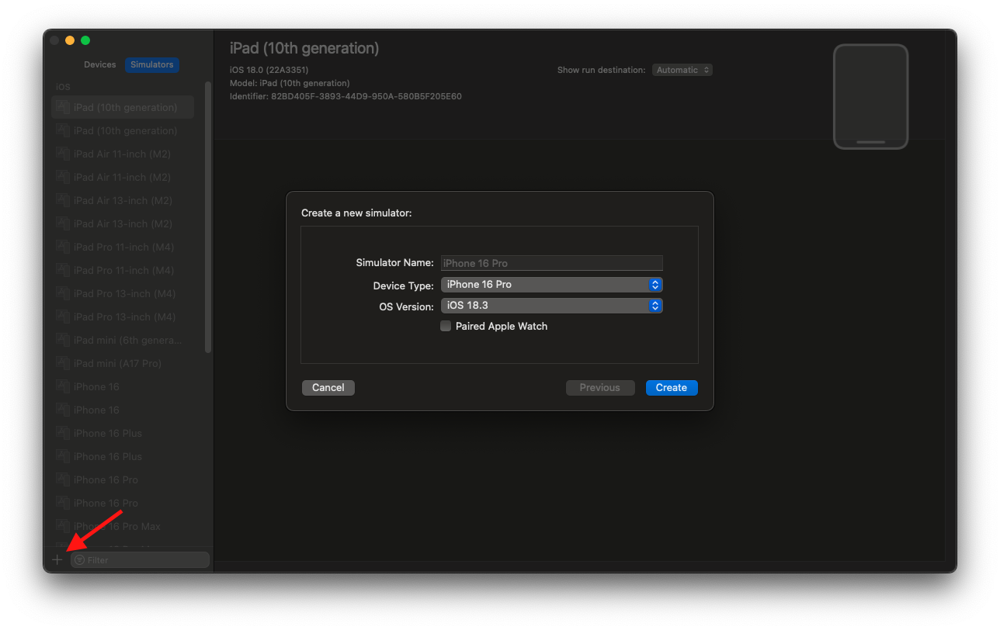
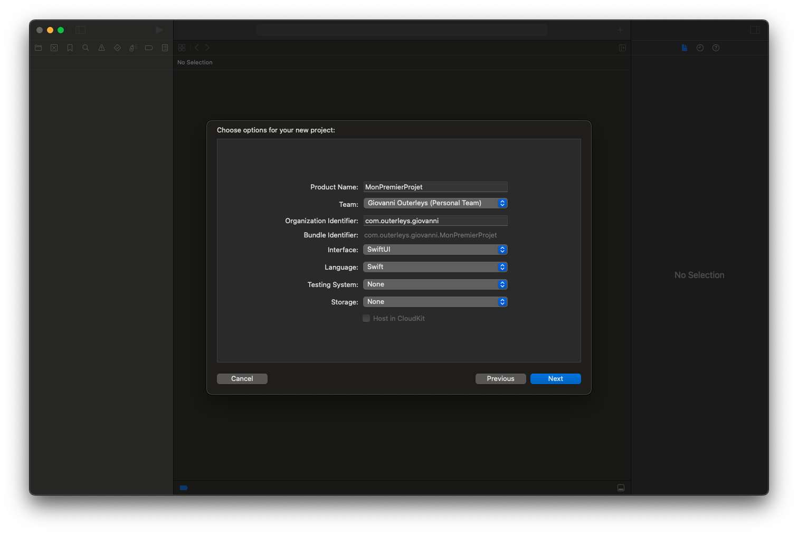
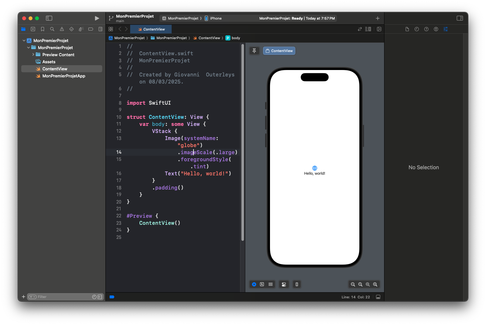

# Installation et Configuration de Xcode pour Développer en SwiftUI

Avant de plonger dans le développement d’applications avec **SwiftUI**, il est essentiel d’installer et de configurer correctement **Xcode**, l’environnement de développement intégré (IDE) d’Apple. Dans cet article, nous allons voir **comment télécharger, installer et optimiser Xcode** pour bien démarrer.

## 📥 Télécharger et Installer Xcode

### 1️⃣ Télécharger Xcode depuis le Mac App Store

Xcode est disponible **gratuitement** sur le **Mac App Store**. Voici comment procéder :

1. **Ouvrez le Mac App Store** depuis votre Mac.
2. **Recherchez "Xcode"** dans la barre de recherche.
3. **Cliquez sur "Obtenir" puis sur "Installer"**.

💡 *Note : La taille de Xcode dépasse les 10 Go, l’installation peut donc prendre du temps en fonction de votre connexion Internet.*


---

### 2️⃣ Installer Xcode via le Terminal (option avancée)

Si vous préférez utiliser le terminal, voici une méthode alternative :

---
```
xcode-select --install
```
---

Cette commande installe les **command line tools** nécessaires pour utiliser **Git**, **Homebrew** et d’autres outils en ligne de commande. Elle ne sera pas abordée dans ce tutoriel, beaucoup trop complexe alors que l'App Store existe ;)

---

## 🛠 Configuration de Xcode après l’installation

Une fois Xcode installé, voici **les étapes essentielles** pour bien le configurer.

### 1️⃣ Ouvrir Xcode pour la première fois

Lancez Xcode depuis le **Launchpad** ou en utilisant **Spotlight** (`Cmd + Espace`, puis tapez "Xcode").

La première ouverture demande souvent d’**accepter les licences Apple** et de télécharger des **composants additionnels**.

---

### 2️⃣ Installer les outils en ligne de commande (Command Line Tools)

Pour que les outils comme **Git** fonctionnent correctement, vérifiez que les **Command Line Tools** sont bien installés :

---
```
xcode-select --install
```
---

Puis, vérifiez l’installation avec :

---
```
xcode-select -p
```
---

Si cela retourne un chemin commençant par `/Library/Developer/CommandLineTools`, alors tout est bon ! ✅

---

### 3️⃣ Configurer le simulateur iOS

Xcode permet de tester vos applications sur des **simulateurs d’appareils Apple**. Pour configurer le simulateur :

1. **Ouvrez Xcode**, puis allez dans **Window > Devices and Simulators > Simulators**.
2. Dans la barre latérale, cliquez sur **l’icône +** et sélectionnez un iPhone (par ex. *iPhone 16 Pro*).


---

## 🎨 Créer un Premier Projet SwiftUI

Maintenant que Xcode est installé et configuré, créons un **premier projet SwiftUI** !

### 📌 Étapes pour créer un projet :

1. **Ouvrir Xcode** et cliquer sur **Create a new Xcode project**.
2. Sélectionner **App** sous la section "iOS".
3. **Nommer le projet** (ex. *MonPremierProjet*).
4. Dans **Interface**, choisir **SwiftUI**.
5. Dans **Language**, choisir **Swift**.
6. Sélectionner **Next**, puis **Create**.

Une fois cela fait, Xcode ouvre automatiquement un fichier `ContentView.swift` avec du code SwiftUI prêt à être exécuté.

---

🎉
### 📌 **Code SwiftUI généré automatiquement dans un nouveau projet :**
---
```
import SwiftUI

struct ContentView: View {
    var body: some View {
        Text("Hello, world!")
            .padding()
    }
}

#Preview {
    ContentView()
}
```
---

## 🚀 Lancer l’Application sur un Simulateur

Pour voir votre premier projet en action :

1. **Sélectionnez un simulateur** (ex. *iPhone 16 Pro*).
2. **Appuyez sur le bouton "Play"** en haut à gauche de Xcode.
3. Attendez que l'application se compile et s'affiche sur le simulateur.


---

## ✅ Conclusion

Félicitations ! 🎉 Vous avez installé et configuré Xcode, et créé votre premier projet SwiftUI. Maintenant que tout est en place, nous allons dans le prochain article explorer **les bases du développement SwiftUI** en détail.


