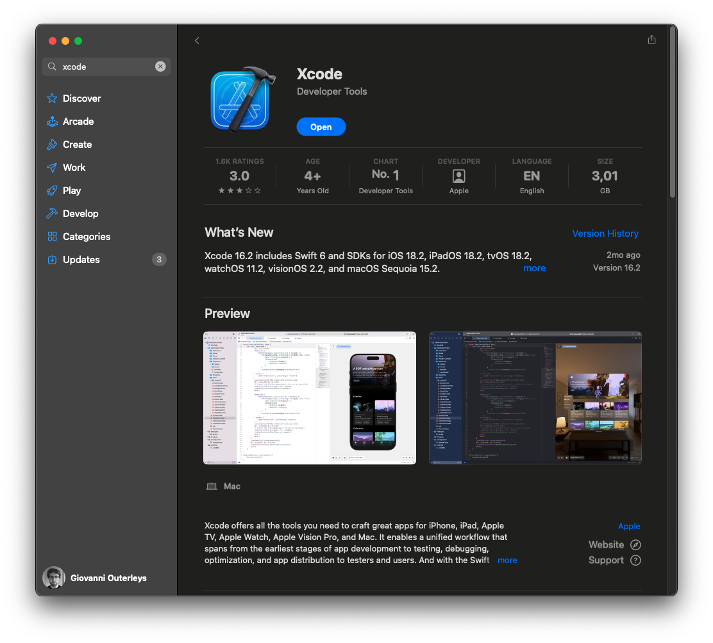

# Installation et Configuration de Xcode pour Développer en SwiftUI

Avant de plonger dans le développement d’applications avec **SwiftUI**, il est essentiel d’installer et de configurer correctement **Xcode**, l’environnement de développement intégré (IDE) d’Apple. Dans cet article, nous allons voir **comment télécharger, installer et optimiser Xcode** pour bien démarrer.

## 📥 Télécharger et Installer Xcode

### 1️⃣ Télécharger Xcode depuis l'App Store

Xcode est disponible **gratuitement** sur l'App Store. Voici comment procéder :

1. **Ouvrez l'App Store depuis votre mac.
2. **Recherchez "xCode"** dans la barre de recherche.
3. **Cliquez sur "Obtenir" puis sur "Installer"**.

💡 *Note : La taille de Xcode dépasse les 10 Go, l’installation peut donc prendre du temps en fonction de votre connexion Internet.*



---

### 2️⃣ Installer Xcode via le Terminal (option avancée)

Si vous préférez utiliser le terminal, voici une méthode alternative :

```sh
xcode-select --install
**