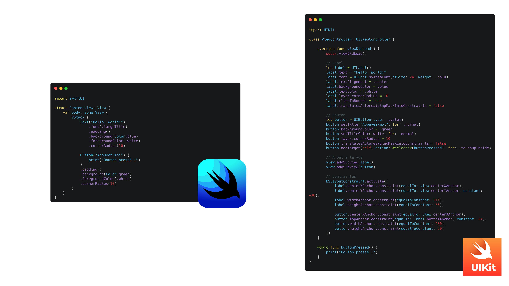
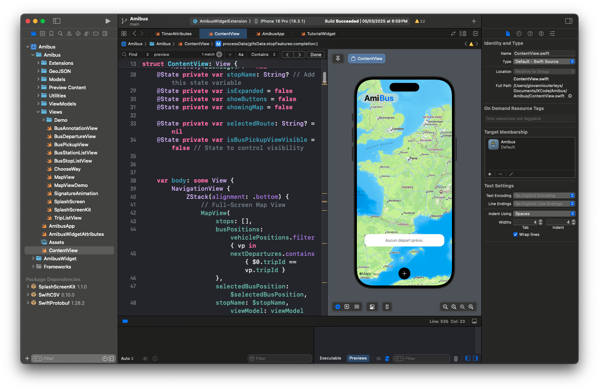

# Introduction à SwiftUI : Un Nouveau Paradigme pour iOS

Depuis l’introduction de SwiftUI en 2019, Apple a radicalement changé la façon dont nous développons des applications pour ses plateformes. Avec une approche déclarative inspirée de frameworks modernes comme React, SwiftUI permet de créer des interfaces utilisateur de manière simple, fluide et intuitive. Mais qu’est-ce qui le rend si spécial ? Pourquoi devriez-vous l’adopter pour vos projets iOS et macOS ? C’est ce que nous allons découvrir dans cet article.

## Qu'est-ce que SwiftUI ?

SwiftUI est un framework développé par Apple permettant de créer des interfaces graphiques en utilisant une approche **déclarative**. Contrairement à UIKit, où l’on doit définir chaque élément de l’interface avec une gestion complexe des états et du cycle de vie, SwiftUI permet de **décrire l’interface** et ses interactions de manière claire et concise.



### Une Syntaxe Déclarative

Avec SwiftUI, fini les longues déclarations et les contraintes de programmation impérative. Voici un exemple simple d’un bouton en SwiftUI :

```swift
import SwiftUI

struct ContentView: View {
    var body: some View {
        Button("Cliquez-moi") {
            print("Bouton pressé !")
        }
        .padding()
        .background(Color.blue)
        .foregroundColor(.white)
        .cornerRadius(10)
    }
}
```

En quelques lignes, nous avons un **bouton stylisé et interactif**. Contrairement à UIKit, où il faudrait gérer l’état et les actions séparément, SwiftUI **simplifie drastiquement le code**.

```swift

 // Le même bouton, mais avec UIKit
override func viewDidLoad() {
    super.viewDidLoad()
    
    // Ajout du texte
    let label = UILabel()
    label.text = "UIKit"
    label.font = UIFont.boldSystemFont(ofSize: 24)
    label.textAlignment = .center
    label.translatesAutoresizingMaskIntoConstraints = false
    
    // Création du bouton
    let button = UIButton(type: .system)
    button.setTitle("Cliquez-moi", for: .normal)
    button.backgroundColor = .blue
    button.setTitleColor(.white, for: .normal)
    button.layer.cornerRadius = 10
    button.translatesAutoresizingMaskIntoConstraints = false
    button.addTarget(self, action: #selector(buttonPressed), for: .touchUpInside)

    // Ajout à la vue
    view.addSubview(label)
    view.addSubview(button)

    // Contraintes
    NSLayoutConstraint.activate([
        label.centerXAnchor.constraint(equalTo: view.centerXAnchor),
        label.topAnchor.constraint(equalTo: view.topAnchor, constant: 100),
        
        button.centerXAnchor.constraint(equalTo: view.centerXAnchor),
        button.topAnchor.constraint(equalTo: label.bottomAnchor, constant: 20),
        button.widthAnchor.constraint(equalToConstant: 200),
        button.heightAnchor.constraint(equalToConstant: 50)
    ])
}

@objc func buttonPressed() {
    print("Bouton pressé !")
}

```
## Pourquoi SwiftUI révolutionne le développement iOS ?

### 1. **Un Code Plus Lisible et Expressif**
SwiftUI repose sur une approche **déclarative**, ce qui signifie que l’on décrit ce que l’interface doit afficher, et non comment elle doit le faire. Cela permet de réduire le nombre de lignes de code et d'améliorer la lisibilité.

### 2. **Un Aperçu en Temps Réel**
Avec **SwiftUI Preview**, plus besoin de compiler l’application pour voir le rendu ! Dès qu’on modifie le code, l’interface se met à jour immédiatement.

---
```
struct ContentView_Previews: PreviewProvider {
    static var previews: some View {
        ContentView()
    }
}
```
---


### 3. **Un Framework Multi-Plateformes**
SwiftUI fonctionne sur **iOS, macOS, watchOS et tvOS**. Vous pouvez utiliser le **même code** pour créer une application qui s’adapte automatiquement aux différentes plateformes Apple.

### 4. **Une Intégration Facile avec UIKit**
SwiftUI et UIKit peuvent coexister dans une même application. Si vous avez une base de code existante en UIKit, vous pouvez **progressivement migrer** vers SwiftUI.

## Conclusion : SwiftUI, le Futur du Développement iOS

SwiftUI est une **révolution** dans le développement Apple. Plus simple, plus rapide et plus efficace, il permet aux développeurs d’être plus productifs et de créer des interfaces modernes avec **moins de code**. Bien qu’il ne remplace pas encore complètement UIKit pour les projets complexes, il est **le choix idéal** pour démarrer une nouvelle application.

Si vous voulez apprendre SwiftUI en profondeur, **restez connectés !** Ce blog vous propose un **e-book complet en 100 chapitres** pour maîtriser SwiftUI, des bases aux fonctionnalités avancées. 🚀