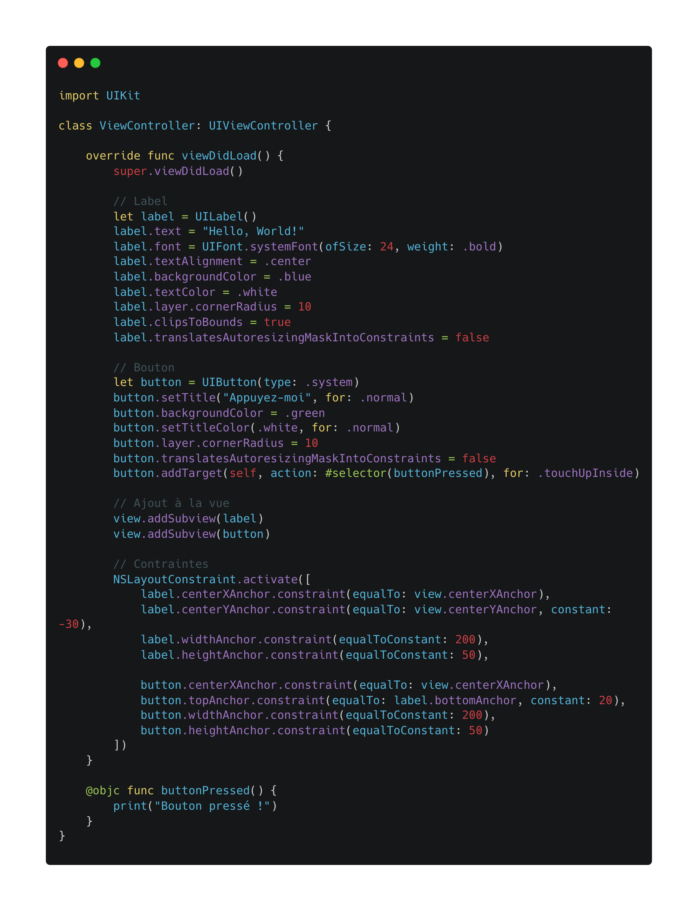
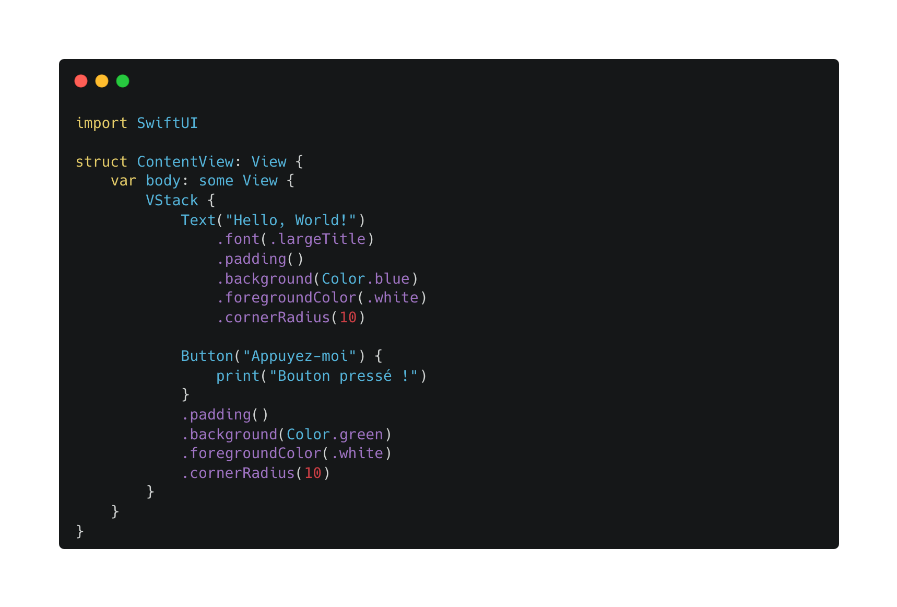

# Introduction à SwiftUI : Un Nouveau Paradigme pour iOS

Depuis l’introduction de SwiftUI en 2019, Apple a radicalement changé la façon dont nous développons des applications pour ses plateformes. Avec une approche déclarative inspirée de frameworks modernes comme React, SwiftUI permet de créer des interfaces utilisateur de manière simple, fluide et intuitive. Mais qu’est-ce qui le rend si spécial ? Pourquoi devriez-vous l’adopter pour vos projets iOS et macOS ? C’est ce que nous allons découvrir dans cet article.

## Qu'est-ce que SwiftUI ?

SwiftUI est un framework développé par Apple permettant de créer des interfaces graphiques en utilisant une approche **déclarative**. Contrairement à UIKit, où l’on doit définir chaque élément de l’interface avec une gestion complexe des états et du cycle de vie, SwiftUI permet de **décrire l’interface** et ses interactions de manière claire et concise.




### Une Syntaxe Déclarative

Avec SwiftUI, fini les longues déclarations et les contraintes de programmation impérative. Voici un exemple simple d’un bouton en SwiftUI :

```swift
import SwiftUI

struct ContentView: View {
    var body: some View {
        Button("Cliquez-moi") {
            print("Bouton pressé !")
        }
        .padding()
        .background(Color.blue)
        .foregroundColor(.white)
        .cornerRadius(10)
    }
}
```
