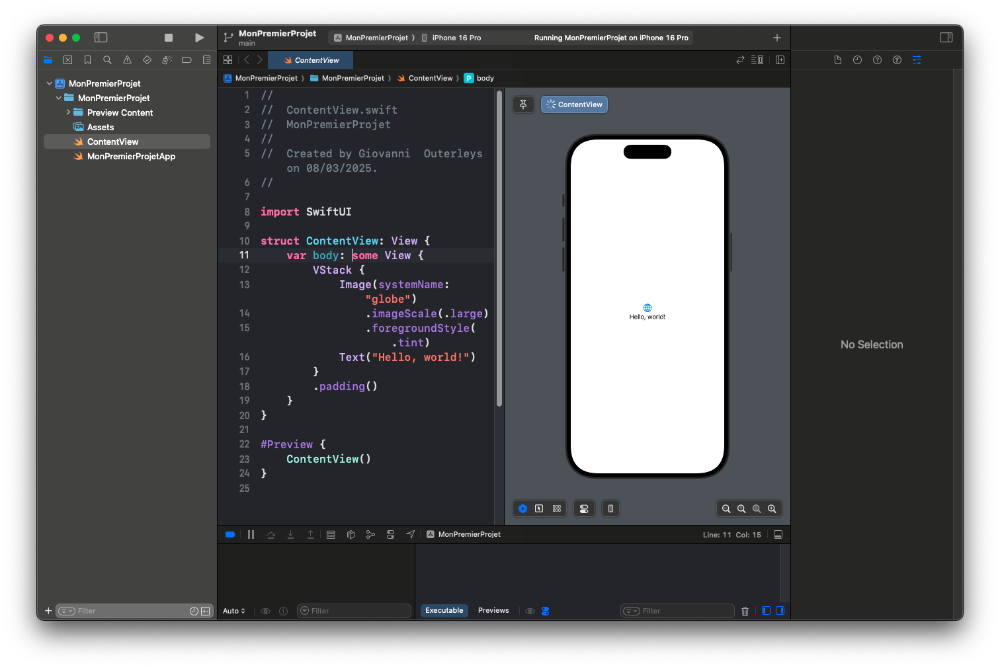
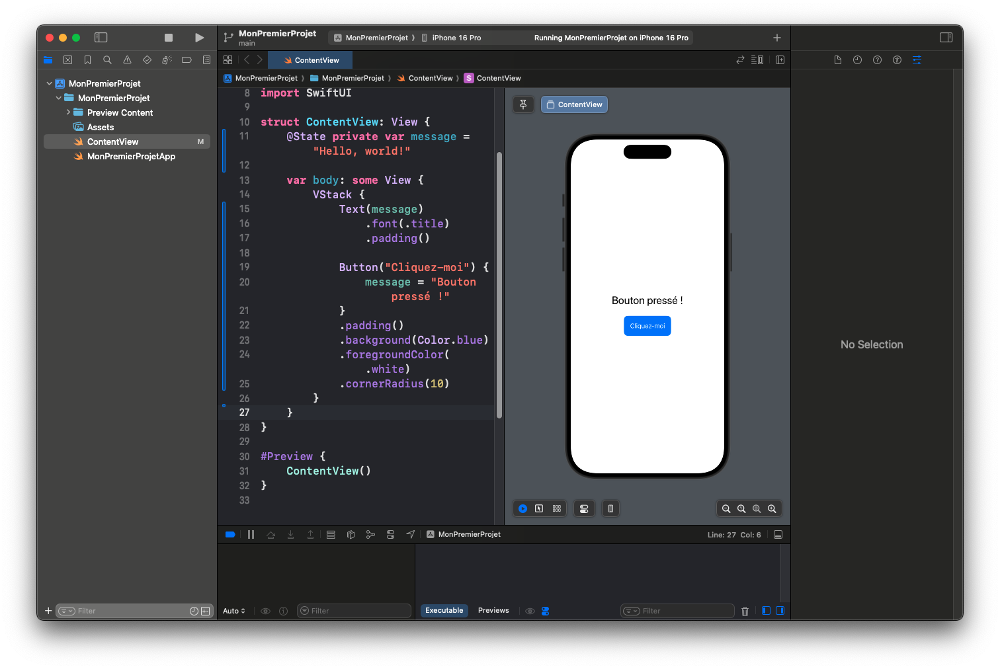
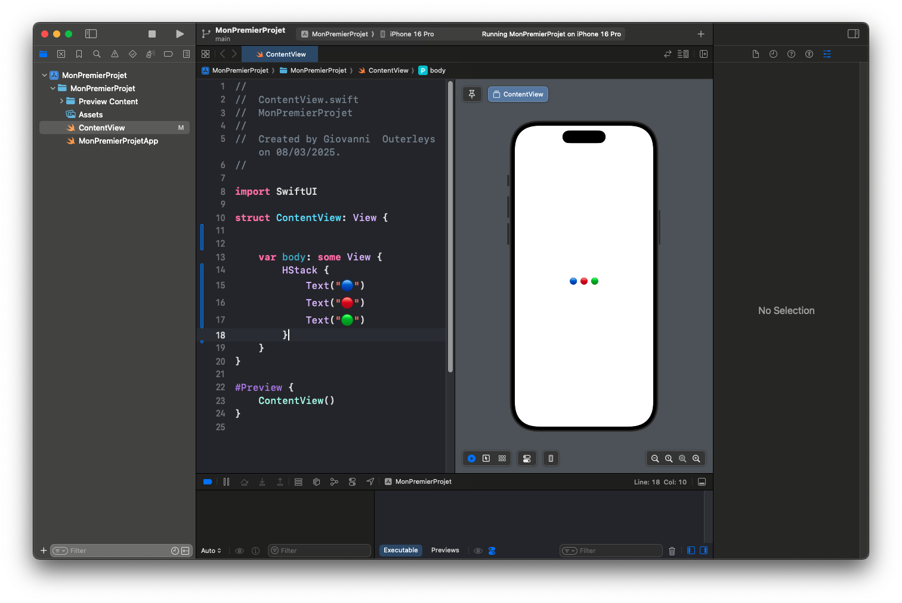
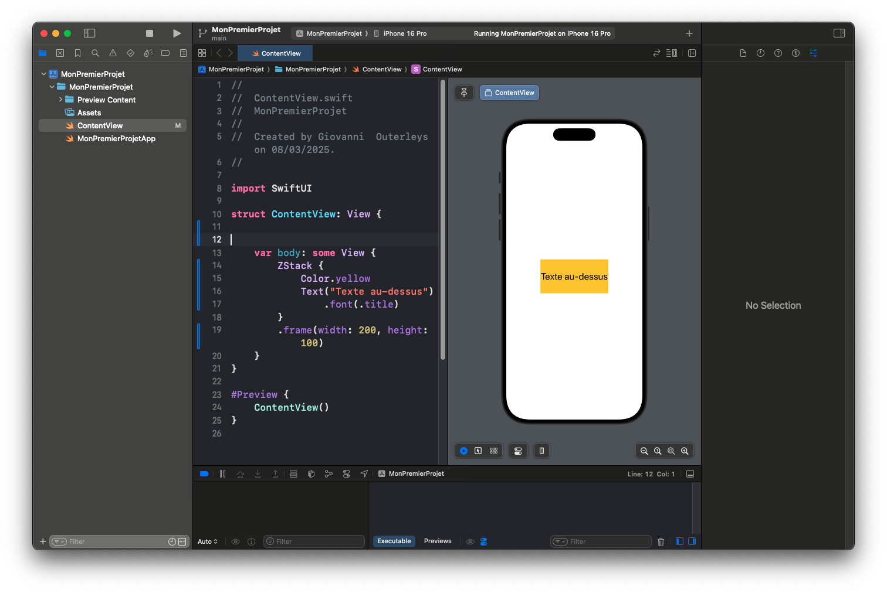
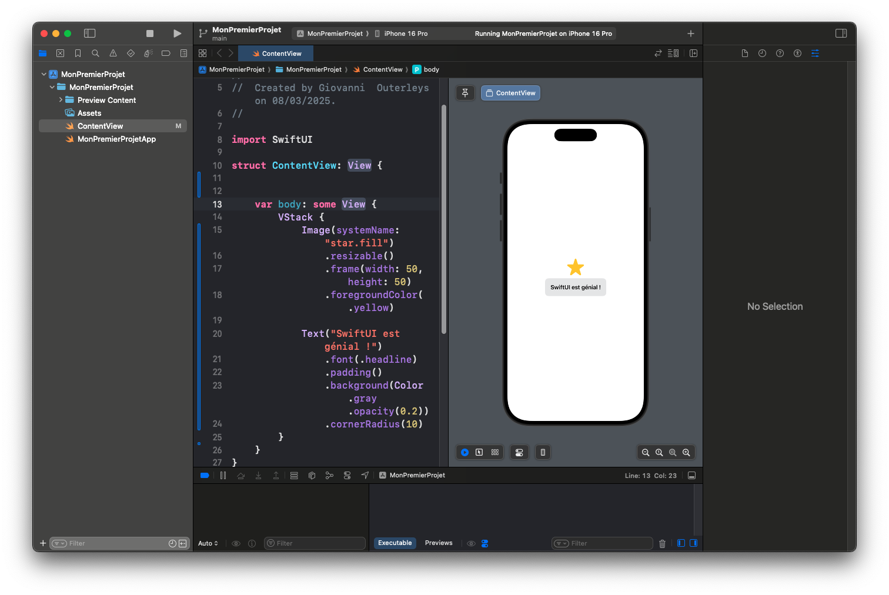

# Premiers Pas avec SwiftUI : Comprendre les Vues et les Layouts

Nous avons installé **Xcode** et créé un premier projet **SwiftUI**. Il est maintenant temps de comprendre **comment fonctionnent les vues et les layouts dans SwiftUI**. Cet article vous guidera dans la construction de votre première interface interactive.

## 📌 Ouvrir et Comprendre `ContentView.swift`

Ouvrez votre projet SwiftUI dans Xcode. Par défaut, Xcode a généré un fichier `ContentView.swift` avec le code suivant :

---
```
import SwiftUI

struct ContentView: View {
    var body: some View {
        Text("Hello, world!")
            .padding()
    }
}

#Preview {
    ContentView()
}
```
---

### 🔍 Décomposition du Code

1. `import SwiftUI` : Importe le framework **SwiftUI**.
2. `struct ContentView: View` : Définit une **vue** nommée `ContentView`, qui est un élément fondamental dans SwiftUI.
3. `var body: some View` : La **propriété `body`** décrit ce que la vue va afficher.
4. `Text("Hello, world!")` : Affiche un simple texte.
5. `.padding()` : Ajoute un **espacement** autour du texte pour améliorer la mise en page.
6. `#Preview` : Permet d'afficher un aperçu en temps réel dans **Xcode Preview**.

---


---

## 🎨 Ajouter une Vue avec un Bouton Interactif

Modifions `ContentView.swift` pour ajouter **un bouton** et afficher un message lorsqu'il est pressé.

---
```
import SwiftUI

struct ContentView: View {
    @State private var message = "Hello, world!"

    var body: some View {
        VStack {
            Text(message)
                .font(.title)
                .padding()

            Button("Cliquez-moi") {
                message = "Bouton pressé !"
            }
            .padding()
            .background(Color.blue)
            .foregroundColor(.white)
            .cornerRadius(10)
        }
    }
}

#Preview {
    ContentView()
}
```
---

### 🔍 Explication

1. `@State private var message = "Hello, world!"`  
   - **@State** permet de **stocker et modifier une valeur** dans SwiftUI.  
   - Ici, `message` contient le texte affiché par `Text()`.  

2. `VStack { ... }`  
   - `VStack` est un **Vertical Stack**, qui **empile les vues verticalement**.  

3. `Button("Cliquez-moi") { ... }`  
   - Crée un bouton avec un **texte modifiable** lorsqu'on clique dessus.  

4. `.background(Color.blue)`, `.foregroundColor(.white)`, `.cornerRadius(10)`  
   - Applique un **style visuel** au bouton (fond bleu, texte blanc, coins arrondis).

---



---

## 📌 Comprendre les Layouts avec `HStack` et `ZStack`

SwiftUI offre plusieurs façons d’organiser les vues :

### **HStack : Disposition Horizontale**
---
```
HStack {
    Text("🔵")
    Text("🔴")
    Text("🟢")
}
```
---


---

### **ZStack : Superposition d'Éléments**
---
```
ZStack {
    Color.yellow
    Text("Texte au-dessus")
        .font(.title)
}
.frame(width: 200, height: 100)
```
---


---

## 🚀 Ajouter une Image et un Style Avancé

Ajoutons **une image** et **un effet d’arrondi**.

---
```
VStack {
    Image(systemName: "star.fill")
        .resizable()
        .frame(width: 50, height: 50)
        .foregroundColor(.yellow)

    Text("SwiftUI est génial !")
        .font(.headline)
        .padding()
        .background(Color.gray.opacity(0.2))
        .cornerRadius(10)
}
```
---


---

## ✅ Conclusion

Félicitations ! 🎉 Vous avez appris :
- **Les bases des vues SwiftUI** (`Text`, `Button`, `Image`).
- **Les layouts (`VStack`, `HStack`, `ZStack`)**.
- **Les interactions avec `@State`**.
^