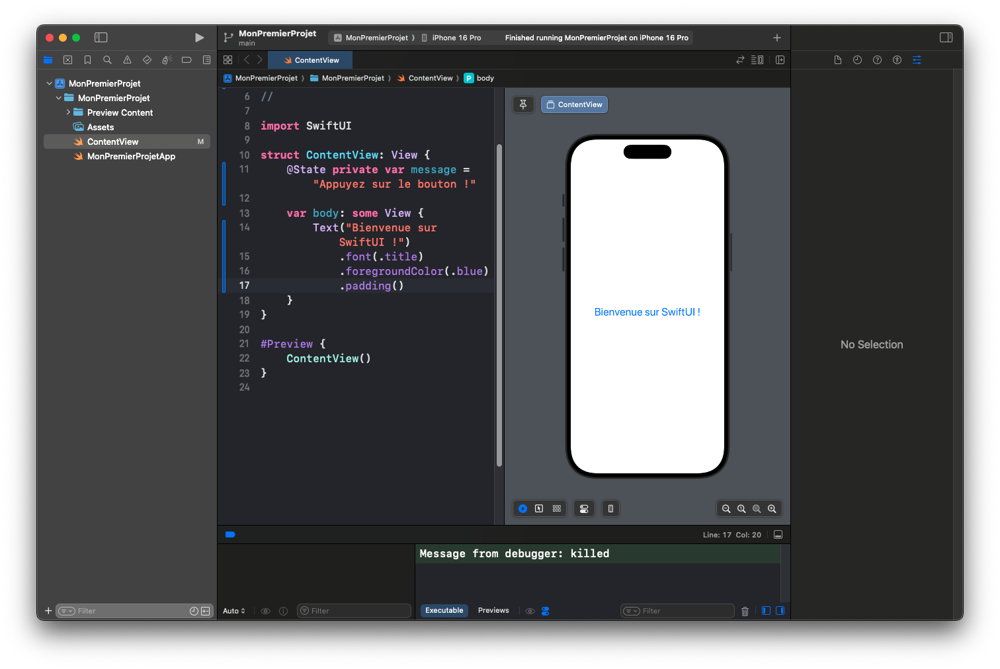
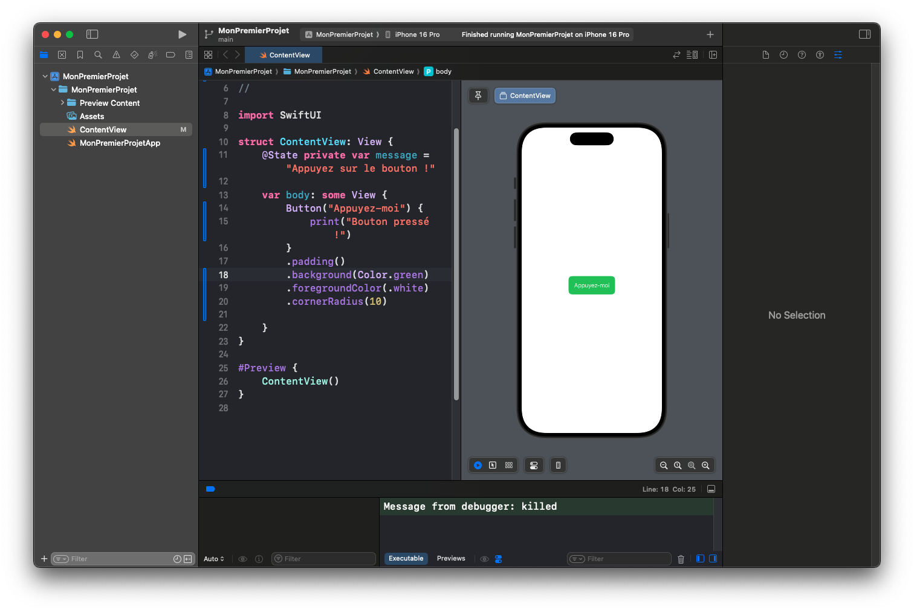
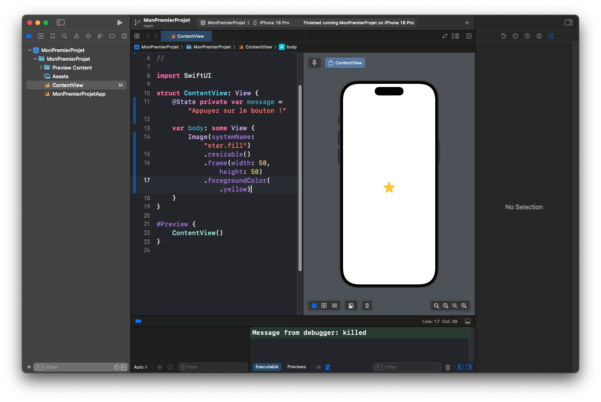
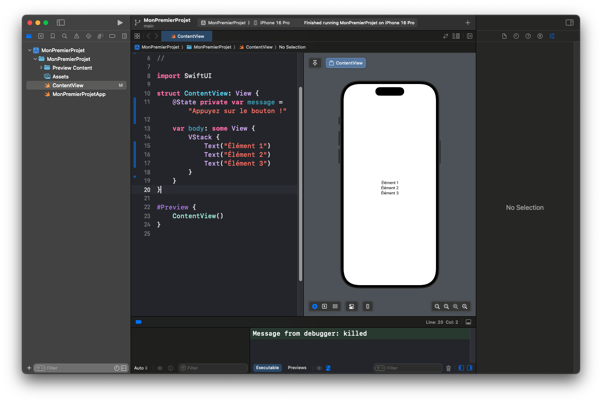
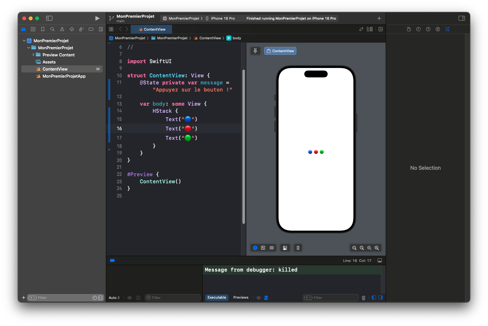
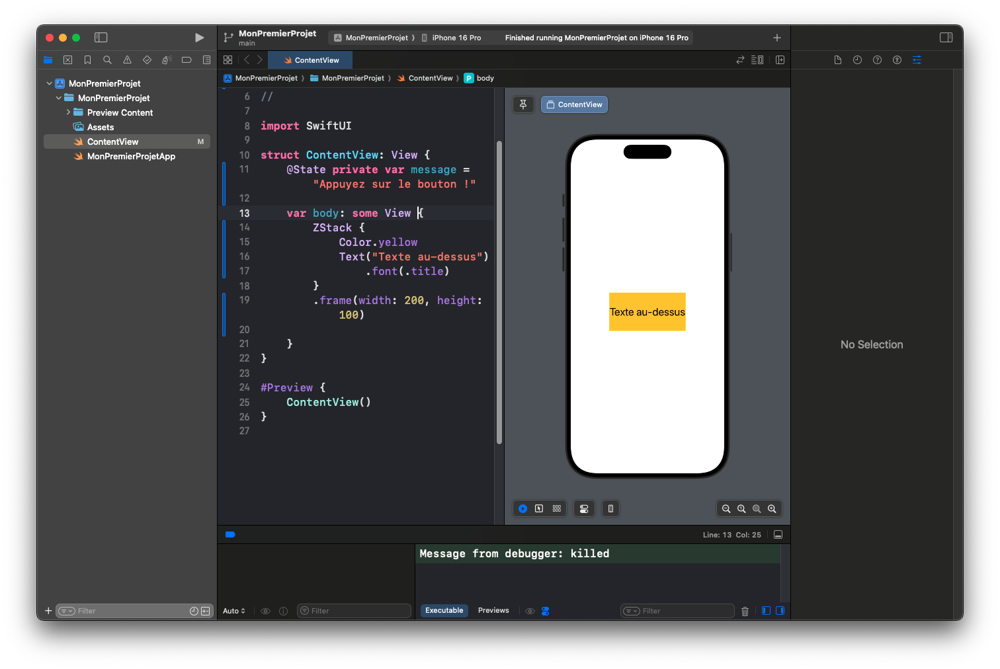
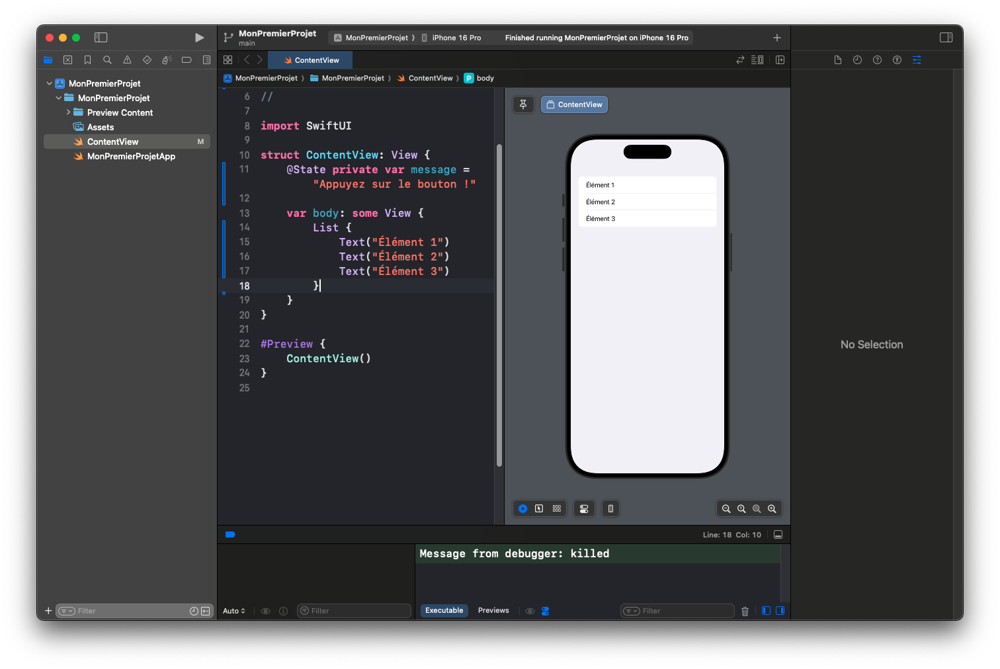
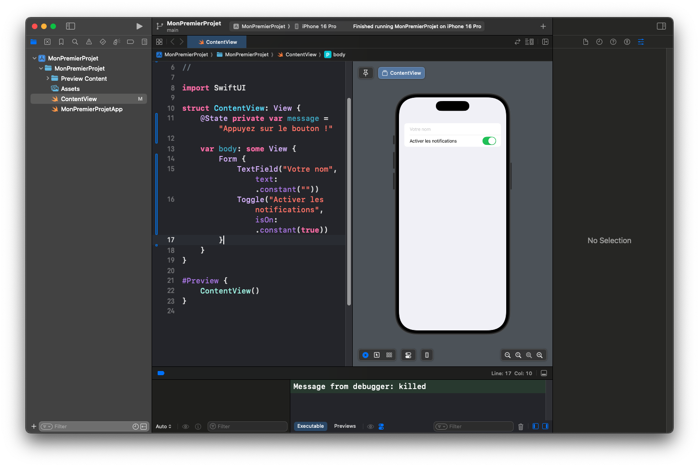
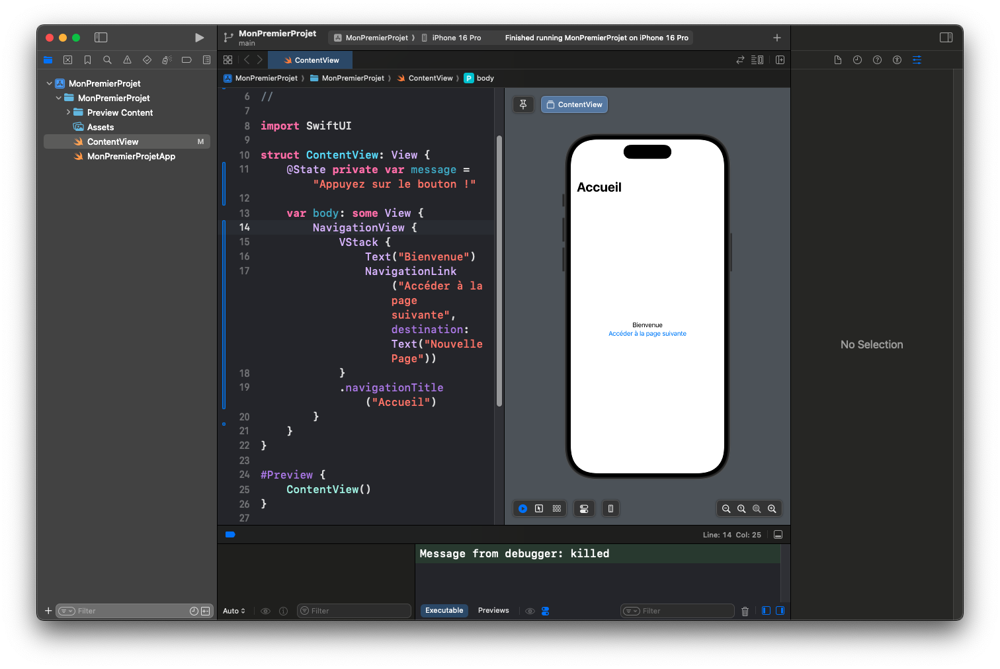

# Vue d’ensemble des Composants SwiftUI

SwiftUI est un **framework déclaratif** qui propose un ensemble **riche et flexible** de composants pour construire des interfaces modernes. Dans cet article, nous allons explorer **les composants fondamentaux** de SwiftUI, leurs usages et comment les combiner pour créer des interfaces intuitives.

---

## 📌 Qu'est-ce qu'un Composant en SwiftUI ?  

Un **composant SwiftUI** est une vue (`View`) qui **représente un élément visuel** de l’interface utilisateur. Ces composants peuvent être **simples** (`Text`, `Button`, `Image`) ou **structurés** (`List`, `Form`, `NavigationView`).

SwiftUI suit une approche **modulaire**, où **chaque composant peut être combiné avec d'autres** pour construire des interfaces plus complexes.

---

## 📜 Les Composants de Base  

### 1️⃣ **Text : Afficher du texte**  

Le composant `Text` permet d'afficher du texte facilement.

---
```swift
Text("Bienvenue sur SwiftUI !")
    .font(.title)
    .foregroundColor(.blue)
    .padding()
```
---



---

### 2️⃣ **Button : Ajouter une interaction**  

Un `Button` permet d'exécuter une action lorsqu'il est pressé.

---
```swift
Button("Appuyez-moi") {
    print("Bouton pressé !")
}
.padding()
.background(Color.green)
.foregroundColor(.white)
.cornerRadius(10)
```
---

💡 **Explication** :
- Le texte du bouton est `"Appuyez-moi"`.
- Quand l’utilisateur clique, `print("Bouton pressé !")` est exécuté.
- On ajoute un **style** (fond vert, texte blanc, coins arrondis).


---

### 3️⃣ **Image : Afficher des images**  

SwiftUI permet d’afficher des images avec `Image`.

---
```swift
Image(systemName: "star.fill")
    .resizable()
    .frame(width: 50, height: 50)
    .foregroundColor(.yellow)
```
---

💡 **Explication** :
- `systemName: "star.fill"` utilise une icône SF Symbols.
- `.resizable()` ajuste la taille de l’image.
- `.foregroundColor(.yellow)` change la couleur.



---

## 🏗 Les Composants de Mise en Page  

SwiftUI propose **des stacks** pour organiser les vues.

### 1️⃣ **VStack : Disposition verticale**  
---
```swift
VStack {
    Text("Élément 1")
    Text("Élément 2")
    Text("Élément 3")
}
```
---

💡 **Les éléments sont empilés verticalement.**



---

### 2️⃣ **HStack : Disposition horizontale**  
---
```swift
HStack {
    Text("🔵")
    Text("🔴")
    Text("🟢")
}
```
---

💡 **Les éléments sont alignés horizontalement.**


---

### 3️⃣ **ZStack : Superposition des éléments**  
---
```swift
ZStack {
    Color.yellow
    Text("Texte au-dessus")
        .font(.title)
}
.frame(width: 200, height: 100)
```
---

💡 **Le texte est superposé sur un fond jaune.**



---

## 📋 Les Composants Structurés  

### 1️⃣ **List : Afficher des données sous forme de liste**  
---
```swift
List {
    Text("Élément 1")
    Text("Élément 2")
    Text("Élément 3")
}
```
---

💡 **Idéal pour afficher des listes dynamiques.**


---

### 2️⃣ **Form : Organiser des champs de saisie**  
---
```swift
Form {
    TextField("Votre nom", text: .constant(""))
    Toggle("Activer les notifications", isOn: .constant(true))
}
```
---

💡 **Utilisé pour créer des formulaires.**



---

## 🧭 La Navigation  

### 1️⃣ **NavigationView : Ajouter une barre de navigation**  
---
```swift
NavigationView {
    VStack {
        Text("Bienvenue")
        NavigationLink("Accéder à la page suivante", destination: Text("Nouvelle Page"))
    }
    .navigationTitle("Accueil")
}
```
---

💡 **Permet de naviguer entre plusieurs écrans.**



---

## ✅ Conclusion  

SwiftUI propose un large éventail de **composants intuitifs** permettant de **concevoir des interfaces modernes et réactives**.  

Vous avez découvert :
- **Les composants de base** (`Text`, `Button`, `Image`).
- **Les structures de mise en page** (`VStack`, `HStack`, `ZStack`).
- **Les composants avancés** (`List`, `Form`, `NavigationView`).

