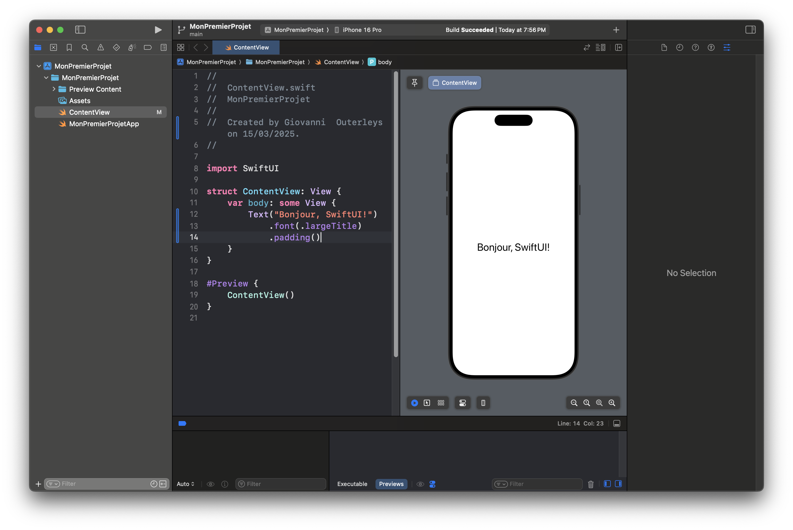
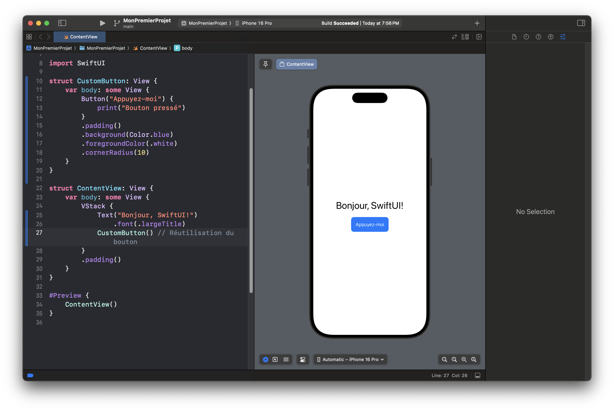

---
title: "La Structure d’une Vue SwiftUI"
date: 2025-03-15 22:00:00 +0100
categories: [SwiftUI, Développement iOS]
tags: [swiftui, vue, structure, développement, ios]
description: "Découvrez comment sont structurées les vues SwiftUI et apprenez à organiser efficacement votre code."
---

# La Structure d’une Vue SwiftUI

Dans SwiftUI, **toutes les interfaces utilisateur** sont définies à l’aide de **vues (`View`)**, qui sont la base du framework. Comprendre la structure d’une vue est essentiel pour créer des applications SwiftUI modulaires et bien organisées.

Dans cet article, nous allons :
- **Explorer la structure d’une vue SwiftUI**.
- **Comprendre le cycle de vie des vues**.
- **Organiser les vues en composants réutilisables**.

---

## 📌 Qu’est-ce qu’une Vue SwiftUI ?

Une vue (`View`) en SwiftUI est une **déclaration** de ce qui doit être affiché à l’écran. Contrairement à UIKit, où l’on manipule les éléments avec des références (`UILabel`, `UIButton`, etc.), SwiftUI **décrit** l’interface sous forme de code **déclaratif**.

Voyons une **vue SwiftUI simple** :

---
```
import SwiftUI

struct ContentView: View {
    var body: some View {
        Text("Bonjour, SwiftUI!")
            .font(.largeTitle)
            .padding()
    }
}

#Preview {
    ContentView()
}
```
---

💡 **Décomposition du code** :
1. `struct ContentView: View`  
   - Définit une **vue SwiftUI** appelée `ContentView`.

2. `var body: some View`  
   - Contient **l’interface** de la vue.

3. `Text("Bonjour, SwiftUI!")`  
   - Affiche un texte à l’écran.

4. `.font(.largeTitle).padding()`  
   - **Applique des styles** (`.font()`, `.padding()`).

---



---

## 🏗 Organisation d’une Vue SwiftUI  

Une vue peut contenir **plusieurs sous-vues**. Pour organiser les éléments, on utilise des **stacks (`VStack`, `HStack`, `ZStack`)**.

---
```
struct ContentView: View {
    var body: some View {
        VStack {
            Text("Titre")
                .font(.title)
            
            Text("Sous-titre")
                .font(.subheadline)
                .foregroundColor(.gray)
            
            Button("Appuyez-moi") {
                print("Bouton pressé")
            }
            .padding()
            .background(Color.blue)
            .foregroundColor(.white)
            .cornerRadius(10)
        }
        .padding()
    }
}
```
---

💡 **Ce que fait ce code** :
- **Empile verticalement** (`VStack`) :
  - Un **titre** (`Text`).
  - Un **sous-titre** (`Text`).
  - Un **bouton interactif**.


---

## 🔄 Le Cycle de Vie d’une Vue SwiftUI  

SwiftUI **reconstruit** automatiquement une vue lorsqu’une **donnée change**. C’est ce qu’on appelle la **réactivité**.

### **Exemple avec `@State`**
---
```
struct ContentView: View {
    @State private var compteur = 0

    var body: some View {
        VStack {
            Text("Compteur : \(compteur)")
                .font(.title)

            Button("Incrémenter") {
                compteur += 1
            }
            .padding()
            .background(Color.green)
            .foregroundColor(.white)
            .cornerRadius(10)
        }
    }
}
```
---

💡 **À chaque clic**, SwiftUI détecte le changement de `compteur` et **met automatiquement à jour l’interface**.


---

## 📦 Découper les Vues en Composants Réutilisables  

Une bonne pratique en SwiftUI est de **découper** les vues en composants modulaires pour **éviter les fichiers trop longs**.

### **Exemple : Séparer le bouton dans une vue dédiée**
---
```
struct CustomButton: View {
    var body: some View {
        Button("Appuyez-moi") {
            print("Bouton pressé")
        }
        .padding()
        .background(Color.blue)
        .foregroundColor(.white)
        .cornerRadius(10)
    }
}

struct ContentView: View {
    var body: some View {
        VStack {
            Text("Bonjour, SwiftUI!")
                .font(.largeTitle)
            CustomButton() // Réutilisation du bouton
        }
        .padding()
    }
}
```
---

💡 **Pourquoi c’est utile ?**
- **Code plus lisible**.
- **Réutilisation facile** (`CustomButton()`).
- **Facilité de maintenance**.



---

## ✅ Conclusion  

Une **vue SwiftUI** est une **structure déclarative** qui :
- **Décrit** l’interface (`body`).
- **Utilise des stacks** pour l’organisation.
- **Gère automatiquement l’état** (`@State`).
- **Peut être découpée en composants réutilisables**.