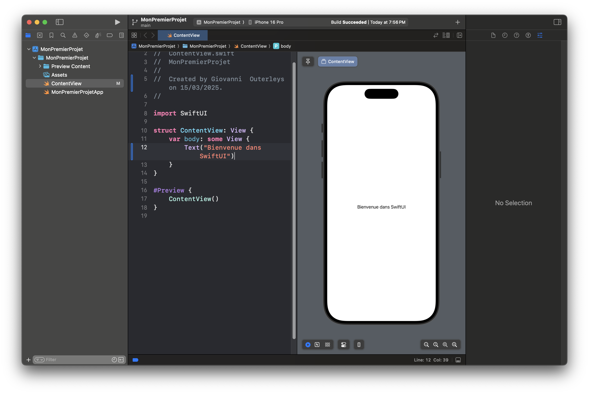
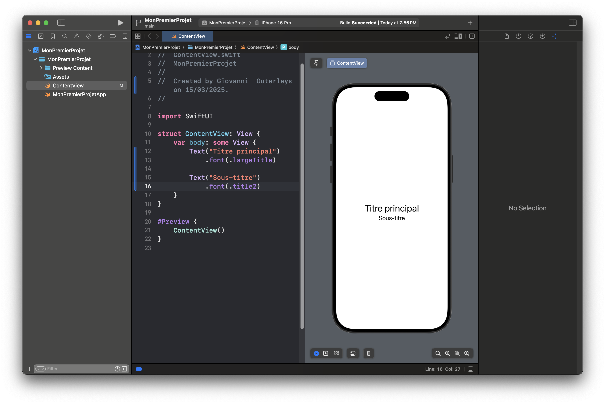
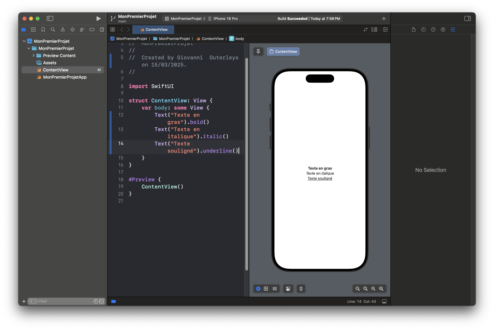
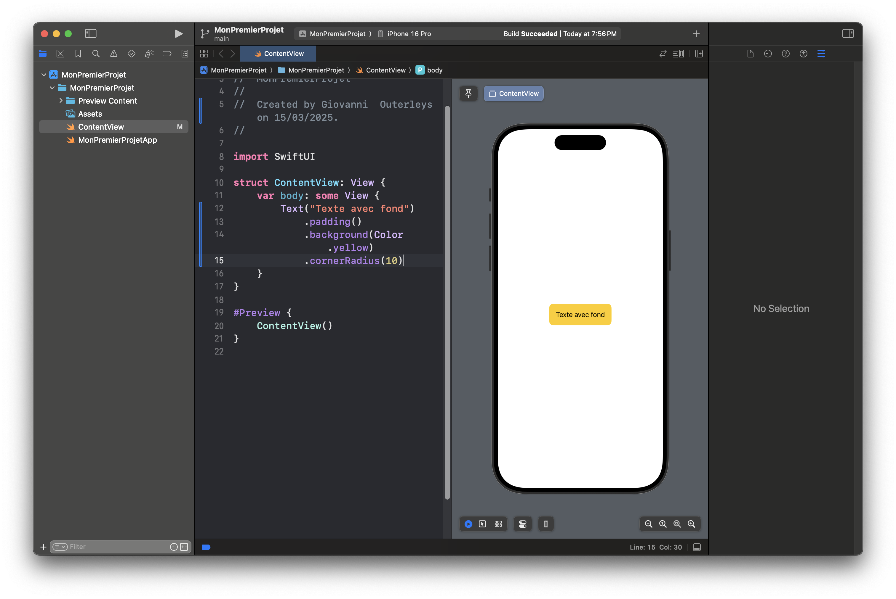
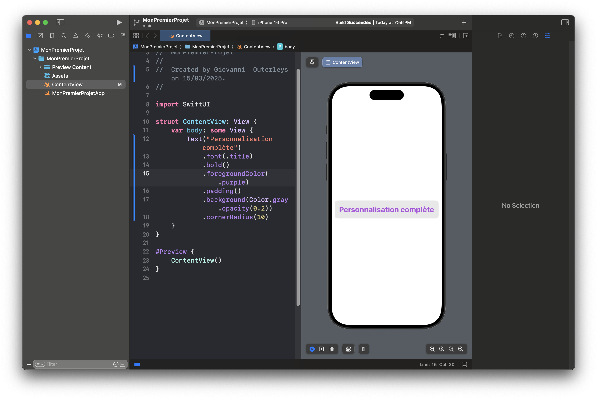

# Texte et Modificateurs de Texte en SwiftUI

Le texte est l’un des éléments fondamentaux d’une interface utilisateur. Dans SwiftUI, le composant `Text` permet d’afficher du contenu textuel **de manière simple et flexible**. Grâce aux **modificateurs SwiftUI**, nous pouvons facilement **styliser et personnaliser le texte**.

Dans cet article, nous allons :
- **Comprendre le composant `Text`**.
- **Explorer les modificateurs de texte** (`.font()`, `.foregroundColor()`, `.bold()`, etc.).
- **Gérer l’alignement et le formatage du texte**.

---

## 📌 Afficher du Texte avec `Text`

Le composant `Text` est utilisé pour afficher du texte dans SwiftUI.

---
```
Text("Bienvenue dans SwiftUI")
```
---



---

## 🎨 Modifier l’Apparence du Texte  

### 1️⃣ **Changer la Taille et la Police**

SwiftUI propose le modificateur `.font()` pour modifier l’apparence du texte.

---
```
Text("Titre principal")
    .font(.largeTitle)

Text("Sous-titre")
    .font(.title2)
```
---

💡 **Exemples de styles disponibles** :
- `.largeTitle`
- `.title`, `.title2`, `.title3`
- `.headline`, `.subheadline`
- `.body`, `.callout`, `.caption`, `.footnote`


---

### 2️⃣ **Appliquer des Styles : Gras, Italique, Souligné**

---
```
Text("Texte en gras").bold()
Text("Texte en italique").italic()
Text("Texte souligné").underline()
```
---


---

### 3️⃣ **Changer la Couleur du Texte**

---
```
Text("Texte en rouge")
    .foregroundColor(.red)
```
---

💡 **Astuce** : Vous pouvez utiliser **les couleurs système** (`.blue`, `.green`, `.orange`) ou définir une couleur personnalisée.


---

## 📏 Alignement et Espacement du Texte

### 1️⃣ **Alignement du Texte**

Pour aligner un texte dans un `VStack`, utilisez `.multilineTextAlignment()`.

---
```
Text("Texte centré sur plusieurs lignes. Il s'adapte automatiquement.")
    .multilineTextAlignment(.center)
```
---

💡 **Options** :
- `.leading` (Gauche)
- `.center` (Centré)
- `.trailing` (Droite)


---

### 2️⃣ **Ajouter un Fond et un Contour au Texte**

---
```
Text("Texte avec fond")
    .padding()
    .background(Color.yellow)
    .cornerRadius(10)
```
---

💡 **Explication** :
- `.padding()` ajoute de l’espace autour du texte.
- `.background(Color.yellow)` ajoute un **fond coloré**.
- `.cornerRadius(10)` arrondit les coins.



---

## 🏗 Combiner Plusieurs Styles de Texte

Avec SwiftUI, on peut combiner plusieurs modificateurs.

---
```
Text("Personnalisation complète")
    .font(.title)
    .bold()
    .foregroundColor(.purple)
    .padding()
    .background(Color.gray.opacity(0.2))
    .cornerRadius(10)
```
---

💡 **Pourquoi c’est puissant ?**
- **Facilité d’utilisation**.
- **Combinaison flexible des styles**.



---

## 🏆 Astuce : Afficher du Texte Dynamique

SwiftUI permet d’afficher des **textes dynamiques** en combinant `@State` et `Text`.

---
```
struct ContentView: View {
    @State private var message = "Bienvenue"

    var body: some View {
        VStack {
            Text(message)
                .font(.title)
            
            Button("Changer le texte") {
                message = "Texte mis à jour !"
            }
            .padding()
            .background(Color.blue)
            .foregroundColor(.white)
            .cornerRadius(10)
        }
    }
}
```
---

💡 **Explication** :
- **Avant le clic** → `"Bienvenue"`.
- **Après le clic** → `"Texte mis à jour !"`.


---

## ✅ Conclusion  

SwiftUI permet de **styliser et personnaliser** le texte avec **peu de code**.  
Dans cet article, nous avons vu :
- Comment **afficher du texte** avec `Text`.
- Les **modificateurs essentiels** (`.font()`, `.bold()`, `.foregroundColor()`…).
- L’**alignement et le formatage** du texte.

📌 **Prochain article : Images et gestion des ressources dans SwiftUI !** 🖼
