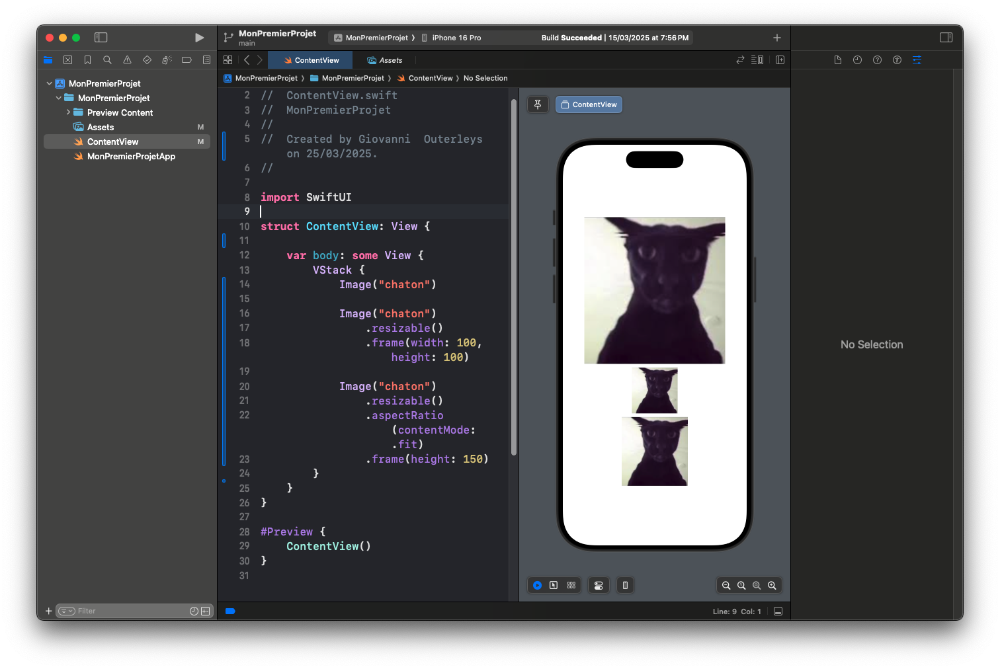
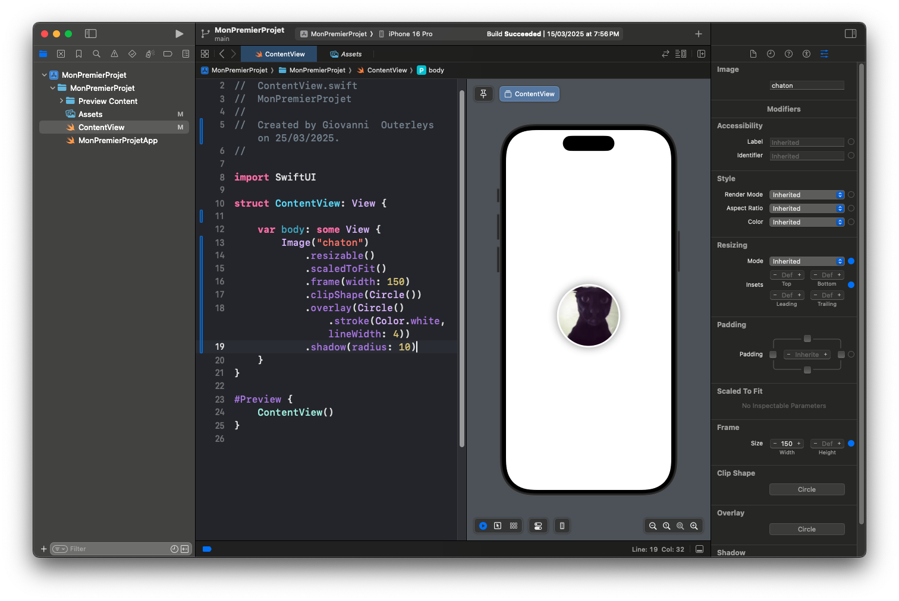
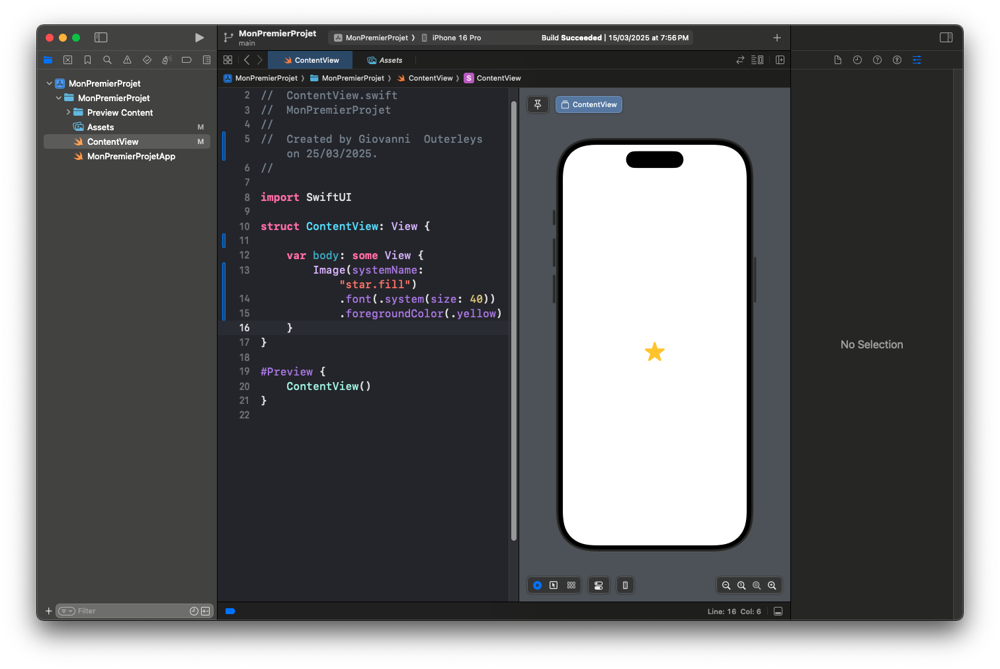

# Images et Gestion des Ressources dans SwiftUI

Les images jouent un rôle essentiel dans l’interface d’une application. Que ce soit pour illustrer un contenu, décorer un écran ou enrichir l'expérience utilisateur, SwiftUI propose une **API simple et puissante** pour gérer les images.

Dans cet article, nous allons :
- Apprendre à **afficher une image locale**.
- Utiliser les **SF Symbols**.
- Gérer les **dimensions et couleurs**.
- Voir comment **charger une image distante**.

---

## 🖼 Afficher une Image Locale  

Pour afficher une image intégrée dans votre projet, utilisez le composant `Image` avec le nom du fichier dans les **Assets**.

### 📁 Ajouter une image dans Xcode

1. Ouvrez le panneau `Assets.xcassets`.
2. Glissez-déposez votre image (par exemple `chaton.jpg`).
3. Appelez-la dans SwiftUI avec :

---
```
Image("chaton")
```
---

💡 **Important** : le nom de l’image doit **correspondre exactement** au nom du fichier dans les assets (sans extension `.jpg` ou `.png`).


---

## 🎨 Redimensionner et Styliser une Image

### 1️⃣ **Changer la taille avec `.resizable()` et `.frame()`**

---
```
Image("chaton")
    .resizable()
    .frame(width: 100, height: 100)
```
---

### 2️⃣ **Garder le ratio avec `.aspectRatio()`**

---
```
Image("chaton")
    .resizable()
    .aspectRatio(contentMode: .fit)
    .frame(height: 150)
```
---

💡 `.fit` adapte l’image au cadre sans la déformer. `.fill` la remplit en recadrant si besoin.



---

## ✨ Ajouter un Style Visuel

SwiftUI permet d’ajouter facilement des effets :

---
```
Image("chaton")
    .resizable()
    .scaledToFit()
    .frame(width: 150)
    .clipShape(Circle())
    .overlay(Circle().stroke(Color.white, lineWidth: 4))
    .shadow(radius: 10)
```
---

💡 **Ce que fait ce code** :
- L’image est **coupée en cercle** (`.clipShape(Circle())`).
- Elle est **entourée d’un contour blanc**.
- Elle a une **ombre douce**.



---

## 🔣 Utiliser les SF Symbols

Apple fournit une **bibliothèque d’icônes vectorielles** appelées **SF Symbols**, intégrées à SwiftUI.

---
```
Image(systemName: "star.fill")
    .font(.system(size: 40))
    .foregroundColor(.yellow)
```
---

💡 Pas besoin d’ajouter de fichier image : tout est intégré !  
Il existe **des centaines d’icônes** disponibles ici : [https://developer.apple.com/sf-symbols/](https://developer.apple.com/sf-symbols/)



---

## 🌐 Afficher une Image Distante (avec AsyncImage)

SwiftUI propose depuis iOS 15 le composant `AsyncImage` pour charger des images depuis une URL.

---
```
AsyncImage(url: URL(string: "https://picsum.photos/200")) { image in
    image
        .resizable()
        .scaledToFit()
        .frame(width: 150)
} placeholder: {
    ProgressView()
}
```
---

💡 **Explication** :
- L’image est chargée depuis une URL distante.
- Un **loader s’affiche** pendant le téléchargement (`ProgressView()`).


---

## 🧼 Astuce : Masquer les erreurs d’image

---
```
AsyncImage(url: URL(string: "https://mauvaise.url/image.jpg")) { phase in
    if let image = phase.image {
        image.resizable()
    } else if phase.error != nil {
        Text("Impossible de charger l’image.")
    } else {
        ProgressView()
    }
}
```
---

💡 Ce code gère les **trois états** :
- Image disponible ✅
- Erreur ❌
- Chargement ⏳

---

## ✅ Conclusion

SwiftUI facilite grandement la gestion des images, qu’elles soient **locales**, **système** (SF Symbols) ou **distantes**. Vous pouvez :
- Ajouter des images dans vos assets.
- Les afficher avec style.
- Charger dynamiquement des images depuis le web.

📌 **Prochain article : Boutons et interactions de base avec SwiftUI !** 🎯
