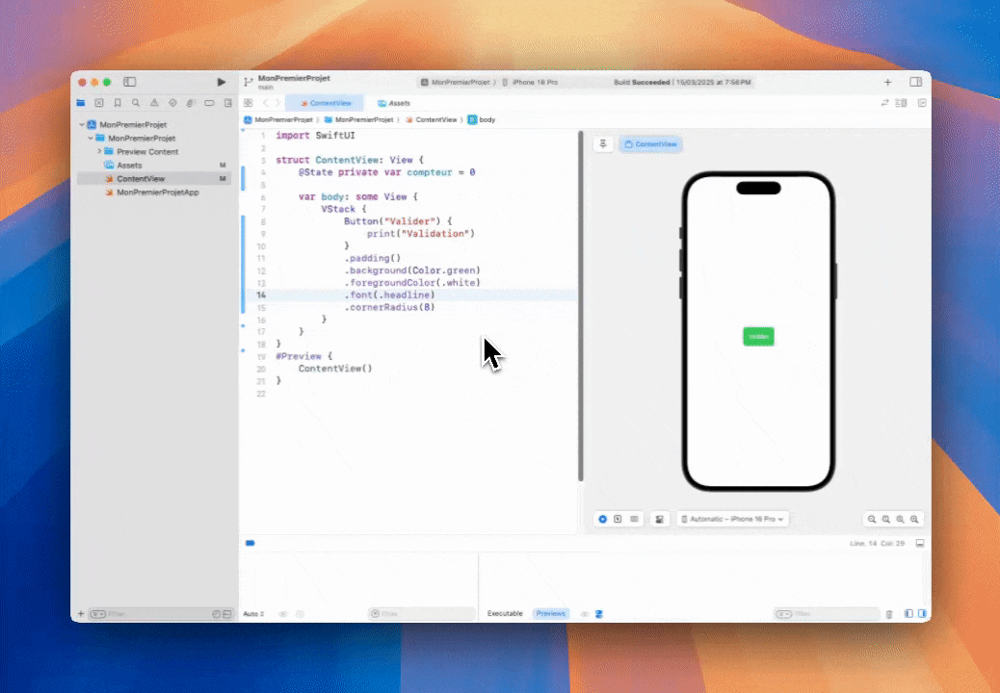

# Boutons et Interactions de Base avec SwiftUI

Les **interactions** sont au cœur d'une application moderne. Dans SwiftUI, les **boutons** permettent de capter des actions de l’utilisateur de manière simple et déclarative.

Dans cet article, tu vas apprendre à :
- Créer des boutons avec SwiftUI.
- Gérer les interactions utilisateur.
- Personnaliser le style des boutons.
- Utiliser des images ou des icônes dans un bouton.

---

## 🧱 Créer un Bouton Simple

Un bouton SwiftUI se crée en utilisant le composant `Button`.

---
```
Button("Appuyez-moi") {
    print("Le bouton a été pressé !")
}
```
---

💡 Le premier paramètre est le **label** (le texte affiché), le second est une **closure** qui définit l’action à exécuter.


---

## 🎯 Interaction avec l’état (`@State`)

Tu peux modifier des données avec un bouton en utilisant `@State`.

---
```
struct ContentView: View {
    @State private var compteur = 0

    var body: some View {
        VStack {
            Text("Compteur : \(compteur)")
                .font(.title)

            Button("Incrémenter") {
                compteur += 1
            }
            .padding()
            .background(Color.blue)
            .foregroundColor(.white)
            .cornerRadius(10)
        }
    }
}
```
---

💡 Ici, le bouton **incrémente un compteur**, et la vue se met à jour automatiquement.


---

## 🎨 Personnaliser un Bouton

Tu peux facilement **styliser un bouton** avec des modificateurs.

---
```
Button("Valider") {
    print("Validation")
}
.padding()
.background(Color.green)
.foregroundColor(.white)
.font(.headline)
.cornerRadius(8)
```
---



---

## 📌 Utiliser une Icône ou une Image

Un bouton peut aussi afficher une image (par exemple une SF Symbol).

---
```
Button(action: {
    print("Favori ajouté")
}) {
    Label("Ajouter", systemImage: "star.fill")
}
.padding()
.background(Color.yellow)
.foregroundColor(.black)
.cornerRadius(10)
```
---

💡 `Label` permet d’ajouter une **icône + texte** dans le même bouton.


---

## 🔄 Désactiver un Bouton

Tu peux rendre un bouton inactif avec `.disabled()`.

---
```
Button("Confirmer") {
    print("Confirmation")
}
.disabled(true)
```
---

💡 Un bouton désactivé n’est pas interactif (et devient grisé par défaut).


---

## 🧠 Astuce : Animation lors d’un clic

Tu peux ajouter une **animation** pour donner du feedback visuel.

---
```
@State private var rotation = 0.0

Button("Tourner") {
    withAnimation {
        rotation += 45
    }
}
.rotationEffect(.degrees(rotation))
```
---

💡 À chaque clic, le bouton tourne de 45° avec une animation fluide.


---

## ✅ Conclusion

SwiftUI rend la création de boutons **intuitive, personnalisable et réactive**.  
Dans cet article, tu as appris à :
- Créer un bouton avec une action.
- Gérer l’état avec `@State`.
- Styliser et enrichir l’interaction avec des icônes et animations.

📌 **Prochain article : Stacks – HStack, VStack, ZStack expliqués simplement !**
