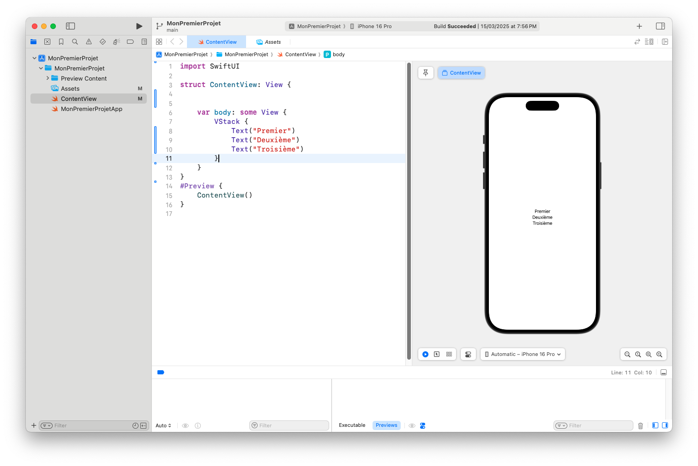
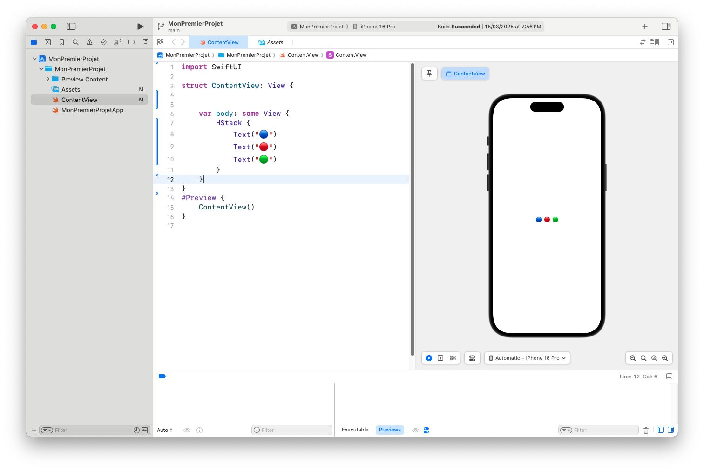
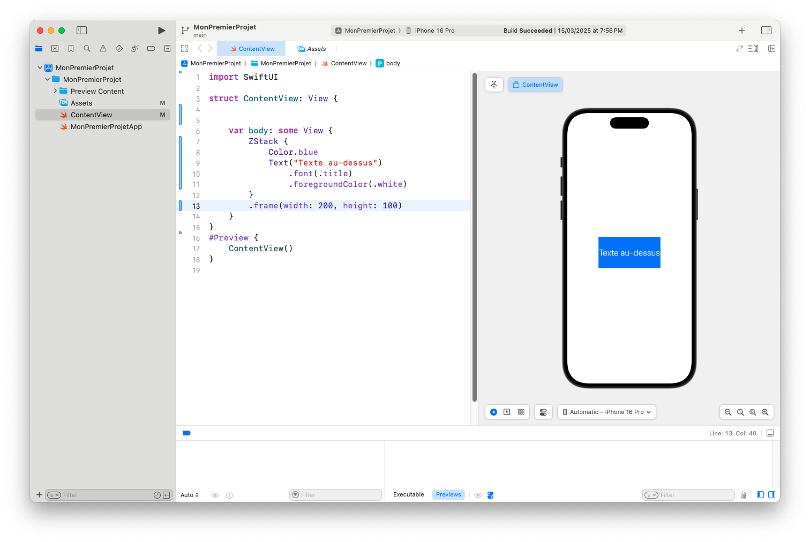
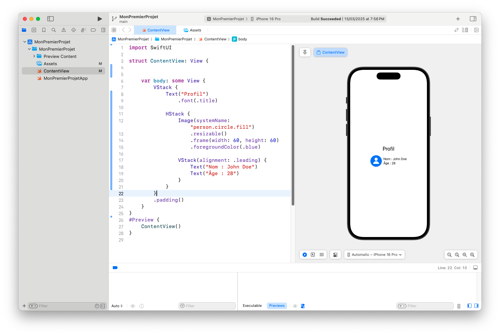
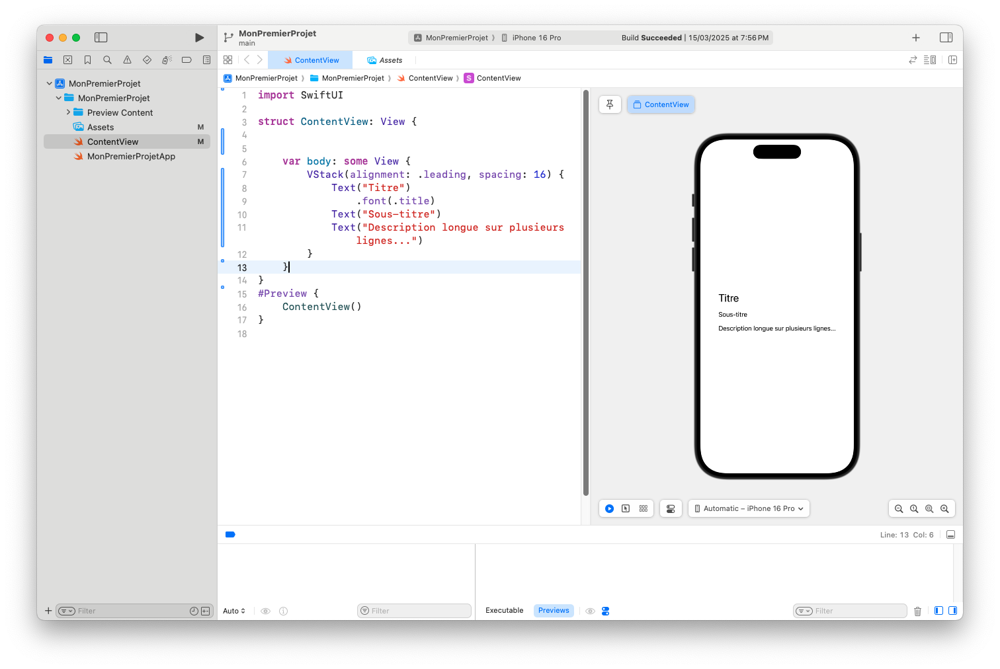

# Comprendre les Stacks : HStack, VStack et ZStack dans SwiftUI

Dans SwiftUI, l’organisation de l’interface se fait principalement à l’aide de **Stacks**. Ces conteneurs permettent de **disposer des vues les unes par rapport aux autres** : horizontalement, verticalement ou en superposition.

Ce sont les fondations de toute interface bien structurée.

Dans cet article, nous allons découvrir :
- `VStack` : disposition verticale
- `HStack` : disposition horizontale
- `ZStack` : superposition des vues
- Comment les combiner pour créer des interfaces complexes

---

## 🧱 VStack – Empilement vertical

`VStack` permet de disposer les éléments **les uns en dessous des autres**.

---
```
VStack {
    Text("Premier")
    Text("Deuxième")
    Text("Troisième")
}
```
---

💡 Le `V` dans `VStack` signifie **Vertical**.



---

## 📏 HStack – Disposition horizontale

`HStack` aligne les éléments **les uns à côté des autres**, sur un axe horizontal.

---
```
HStack {
    Text("🔵")
    Text("🔴")
    Text("🟢")
}
```
---

💡 Le `H` dans `HStack` signifie **Horizontal**.



---

## 🪄 ZStack – Superposition des vues

`ZStack` permet de **superposer** les éléments les uns sur les autres (comme des calques).

---
```
ZStack {
    Color.blue
    Text("Texte au-dessus")
        .font(.title)
        .foregroundColor(.white)
}
.frame(width: 200, height: 100)
```
---

💡 Le `Z` fait référence à **l’axe de profondeur** (comme en 3D).



---

## 🔄 Combiner plusieurs Stacks

Tu peux imbriquer plusieurs stacks pour créer des interfaces plus élaborées.

---
```
VStack {
    Text("Profil")
        .font(.title)

    HStack {
        Image(systemName: "person.circle.fill")
            .resizable()
            .frame(width: 60, height: 60)
            .foregroundColor(.blue)

        VStack(alignment: .leading) {
            Text("Nom : John Doe")
            Text("Âge : 28")
        }
    }
}
.padding()
```
---

💡 Ici, on combine :
- un `VStack` principal,
- un `HStack` pour l’image et les infos,
- un `VStack` à l’intérieur du `HStack`.


---

## 🧩 Espacement et alignement dans les Stacks

Tu peux ajuster l’espace et l’alignement dans chaque stack.

### Exemple avec `spacing` et `alignment` :

---
```
VStack(alignment: .leading, spacing: 16) {
    Text("Titre")
        .font(.title)
    Text("Sous-titre")
    Text("Description longue sur plusieurs lignes...")
}
```
---

💡 Cela :
- **aligne le contenu à gauche**,
- **ajoute de l’espace vertical** entre les éléments.


---

## ✅ Conclusion

Les stacks sont **indispensables** pour construire des interfaces claires et responsives dans SwiftUI.

Avec :
- `VStack` pour empiler verticalement,
- `HStack` pour aligner horizontalement,
- `ZStack` pour superposer,

...tu as tous les outils pour structurer une interface élégante.

📌 **Prochain article : Espacements, Padding et Alignements dans SwiftUI !**
