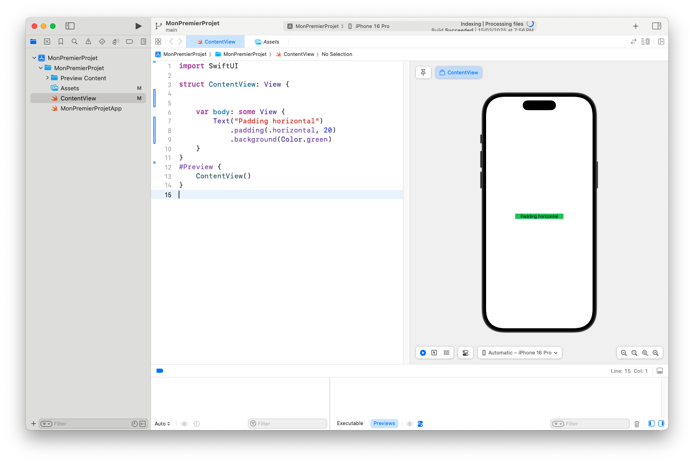
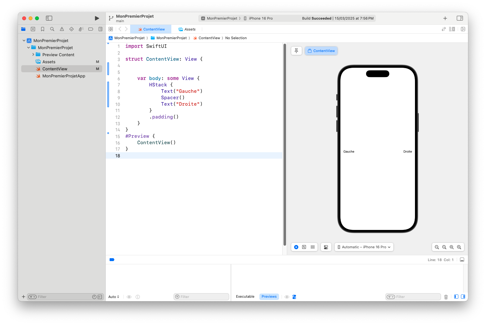

# Espacements, Padding et Alignements dans SwiftUI

Dans SwiftUI, la **gestion des espacements** et **l’alignement des vues** sont essentiels pour créer des interfaces visuellement harmonieuses. Grâce à quelques modificateurs bien choisis, tu peux ajuster précisément la disposition de tes éléments.

Dans cet article, tu vas apprendre à :
- Utiliser `.padding()` pour aérer une vue
- Ajouter de l’espace entre les éléments avec `Spacer` et `spacing`
- Aligner des vues dans des `Stack`
- Utiliser `.frame()` pour gérer la taille et la position

---

## 📦 Le modificateur `.padding()`

Le padding ajoute de l’**espace intérieur autour d’une vue**, comme des marges internes.

### Padding par défaut :

---
```
Text("Hello SwiftUI")
    .padding()
    .background(Color.yellow)
```
---

💡 Cela ajoute un **padding uniforme** autour du texte.

### Padding spécifique :

---
```
Text("Padding horizontal")
    .padding(.horizontal, 20)
    .background(Color.green)
```
---

💡 Tu peux aussi utiliser :
- `.vertical`
- `.top`, `.bottom`, `.leading`, `.trailing`


---

## 🧱 Espacer les éléments avec `Spacer`

`Spacer()` pousse les éléments au maximum de l’espace disponible.

---
```
HStack {
    Text("Gauche")
    Spacer()
    Text("Droite")
}
.padding()
```
---

💡 `Spacer()` crée un **vide extensible** entre les éléments.


---

## 📐 Contrôle de l’espacement avec `spacing`

Tu peux définir l’espace entre les vues dans un `Stack` via le paramètre `spacing`.

---
```
VStack(spacing: 40) {
    Text("Un")
    Text("Deux")
    Text("Trois")
}
```
---

💡 Le paramètre `spacing` est facultatif et s’applique entre chaque vue du stack.

---

## 📏 Définir les dimensions avec `.frame()`

Le modificateur `.frame()` permet de fixer une **largeur, hauteur, ou les deux**.

---
```
Text("Avec frame")
    .frame(width: 200, height: 100)
    .background(Color.orange)
```
---

💡 Utile pour créer des zones de clic précises ou des mises en page rigides.

---

## 🧭 Aligner les vues dans un `Stack`

Dans une `VStack` ou `HStack`, tu peux contrôler l’**alignement** global :

---
```
VStack(alignment: .leading) {
    Text("Titre")
        .font(.title)
    Text("Sous-titre")
    Text("Description")
}
.frame(maxWidth: .infinity, alignment: .leading)
```
---

💡 Combine l’**alignement du stack** avec le **modificateur `frame(alignment:)`**.

---

## 🧠 Astuce : Centrer facilement une vue

Pour centrer une vue horizontalement dans son conteneur :

---
```
Text("Centré")
    .frame(maxWidth: .infinity)
    .multilineTextAlignment(.center)
```
---

Et pour centrer verticalement dans un `VStack`, ajoute un `Spacer()` au-dessus et en dessous.

---

## ✅ Conclusion

Une interface réussie repose sur **un bon équilibre visuel**. Grâce à `.padding()`, `Spacer()`, `.frame()` et l’alignement des stacks, tu peux contrôler précisément **l’espace et la position** de tes éléments.

Tu as appris à :
- Utiliser le padding intelligemment
- Gérer les espacements internes et externes
- Aligner les vues horizontal
