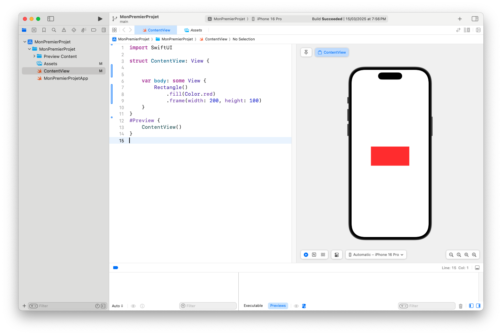
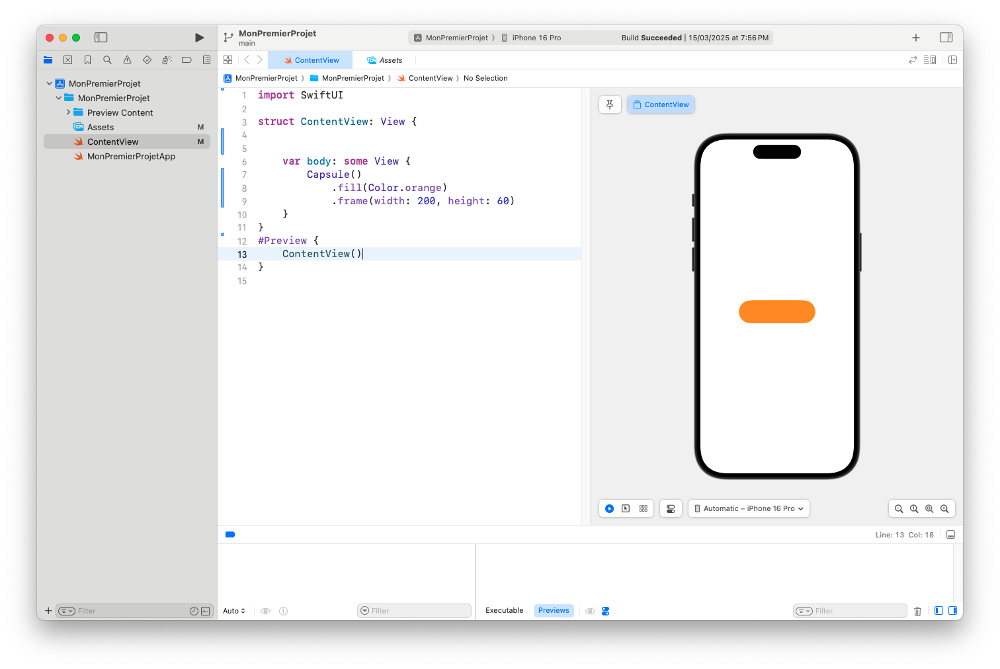
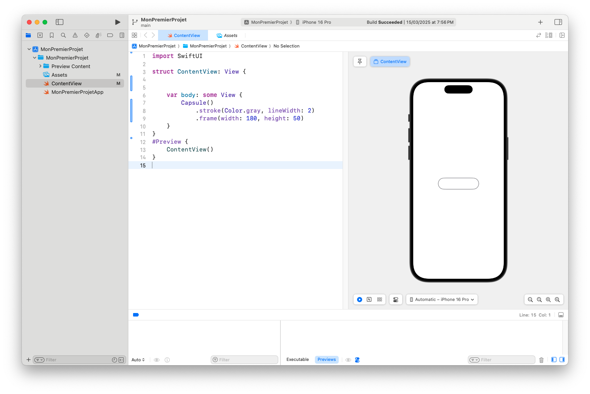
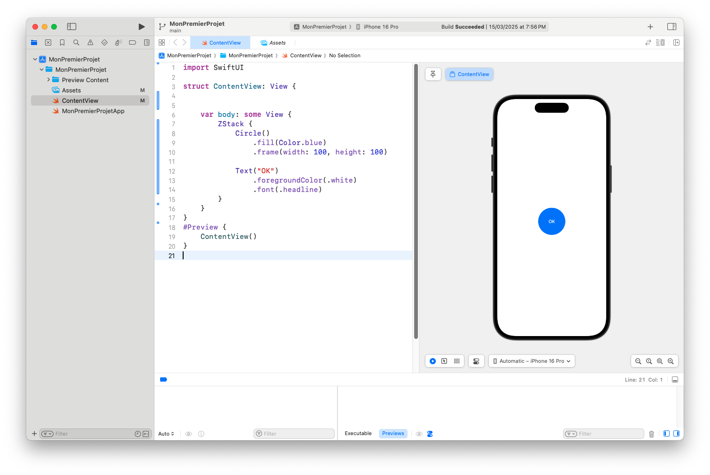

# Les Formes dans SwiftUI : Rectangle, Cercle et Capsule

SwiftUI permet de créer facilement des formes géométriques pour enrichir l’interface utilisateur. Que ce soit pour délimiter une zone, afficher un avatar ou styliser un bouton, les **formes** comme `Rectangle`, `Circle` et `Capsule` sont simples à utiliser et très puissantes.

Dans cet article, tu vas apprendre à :
- Utiliser les formes de base
- Modifier leur apparence (taille, couleur, bordure)
- Les intégrer à tes composants

---

## 🟥 Rectangle

Le `Rectangle` est une forme simple qui remplit la surface disponible, sauf si on la contraint avec `.frame()`.

---
```
Rectangle()
    .fill(Color.red)
    .frame(width: 200, height: 100)
```
---

💡 `.fill(Color.red)` permet de remplir le rectangle avec une couleur rouge.



---

### ✅ Avec bordure

---
```
Rectangle()
    .stroke(Color.blue, lineWidth: 4)
    .frame(width: 150, height: 80)
```
---

💡 `.stroke()` dessine uniquement le contour, ici en bleu.

---

## ⚪ Circle

Le `Circle` crée un cercle parfait. Il est souvent utilisé pour des **avatars**, des **icônes**, ou des **effets décoratifs**.

---
```
Circle()
    .fill(Color.green)
    .frame(width: 100, height: 100)
```
---

💡 Si `width` ≠ `height`, le cercle devient une **ellipse** (ou capsule !).

---

### ✅ Avec contour et ombre

---
```
Circle()
    .stroke(Color.purple, lineWidth: 3)
    .frame(width: 120, height: 120)
    .shadow(radius: 5)
```
---


---

## 🧼 Capsule

La `Capsule` est une forme ovale aux bords arrondis, idéale pour les **boutons stylisés**, les **tags**, ou les **badges**.

---
```
Capsule()
    .fill(Color.orange)
    .frame(width: 200, height: 60)
```
---


---

💡 Plus la largeur est grande comparée à la hauteur, plus la forme est "capsulée".

---

### ✅ Capsule avec bordure

---
```
Capsule()
    .stroke(Color.gray, lineWidth: 2)
    .frame(width: 180, height: 50)
```
---



---

## 🖼 Combiner Forme + Texte

Tu peux **superposer du texte sur une forme** avec un `ZStack` :

---
```
ZStack {
    Circle()
        .fill(Color.blue)
        .frame(width: 100, height: 100)

    Text("OK")
        .foregroundColor(.white)
        .font(.headline)
}
```
---


💡 C’est parfait pour créer un **badge circulaire**.

---

## 🧠 Astuce : Utiliser `.clipShape()` avec une forme

Tu peux aussi **découper une image ou une vue** avec une forme, comme un masque.

---
```
Image("profil")
    .resizable()
    .scaledToFill()
    .frame(width: 100, height: 100)
    .clipShape(Circle())
```
---

💡 Combine avec `.overlay()` et `.shadow()` pour un effet "avatar stylisé".

---

## ✅ Conclusion

Les formes de base comme `Rectangle`, `Circle` et `Capsule` sont très simples à implémenter, mais extrêmement puissantes pour :
- Structurer l’interface
- Mettre en valeur un élément
- Styliser une image ou un bouton

📌 **Prochain article : Dégradés et couleurs personnalisées dans SwiftUI !** 🌈
